<!-- ======================= HEADER ======================= -->

<h1 align="center">Hi 👋, I'm Hasan Iqbal</h1>


<p align="left">

* 💻 Software Developer focused on backend development, APIs, and system integration.
* 🔌 Currently working with IBM API Connect and IBM App Connect Enterprise to build and integrate APIs across multiple systems.
* 🧠 Interested in backend architecture, distributed systems, cloud-native applications, and machine learning.
* 🎥 Outside of software development, I enjoy creating videos, editing, and visual storytelling.

<h3>🚀 What I'm Currently Exploring</h3>

- ⚙️ Building backend services and APIs with <b>FastAPI</b>
- 🤖 Exploring <b>Generative AI, LLMs, and AI-powered applications</b>
- 🧠 Deepening my knowledge of <b>Machine Learning and Deep Learning</b>
- 🔗 Designing and integrating <b>REST APIs and enterprise systems</b>
- ☁️ Exploring <b>cloud-native development, Docker, and DevOps</b>
</p>

<br>

<!-- ======================= SOCIALS ======================= -->

<p align="center">
  <a href="https://www.linkedin.com/in/hasan-iqbal-/">
    
  </a>
  <a href="https://github.com/hasaniqbalhere">
    
  </a>
  <a href="mailto:hihasaniqbal@gmail.com">
    
  </a>
</p>

<br>

<!-- ======================= GITHUB STATS ======================= -->

<h2 align="center">📊 GitHub Stats</h2>

<p align="center">
  
</p>

<br>

<!-- ======================= TECH STACK ======================= -->

<h2 align="center">💻 Tech Stack</h2>

<p align="center">
  I enjoy building backend systems, APIs, integrations, and intelligent applications.
  My interests span software engineering, machine learning, cloud technologies, and
  creative development.
</p>

<details align="center">
  <summary>Click for more Details...</summary>

  <br>

  <!-- ======================= LANGUAGES ======================= -->
<h3>Programming Languages</h3>

<p align="center"> 
 
    


 
 


<!-- ======================= BACKEND ======================= -->

<h3>Backend Development</h3>

<p align="center"> 
<!--   -->
 </p>

<!-- ======================= API & ENTERPRISE INTEGRATION ======================= -->

<h3>API & Enterprise Integration</h3>

<p align="center">
 
 
 
 
 
 </p>

<!-- ======================= API SECURITY ======================= -->

<h3>API Security & Testing</h3>
```html
<p align="center">
  
  
  
  
</p>

<!-- ======================= AI & MACHINE LEARNING ======================= -->

<h3>AI, Machine Learning & LLMs</h3>

<p align="center">
  
  
  
  
  
  
</p>

<!-- ======================= DATA SCIENCE ======================= -->

<h3>Data Science</h3>

<p align="center">
  
  
  
</p>

<!-- ======================= DATABASES ======================= -->

<h3>Databases</h3>

<p align="center">
  
  
</p>

</details>
<!-- <br> -->

<!-- ======================= TOP REPOSITORIES ======================= -->

<!-- <h2 align="center">📂 Featured Projects</h2>

<p align="center">
  <a href="https://github.com/hasaniqbalhere/LinguaLink">
    
  </a>

  <a href="https://github.com/hasaniqbalhere/Quantum_Edge_Detection">
    
  </a>
</p> -->

<!-- <br> -->

<!-- ======================= FOOTER ======================= -->

<p align="center">
  <i>Always learning. Always building. Always exploring.</i>
</p>
